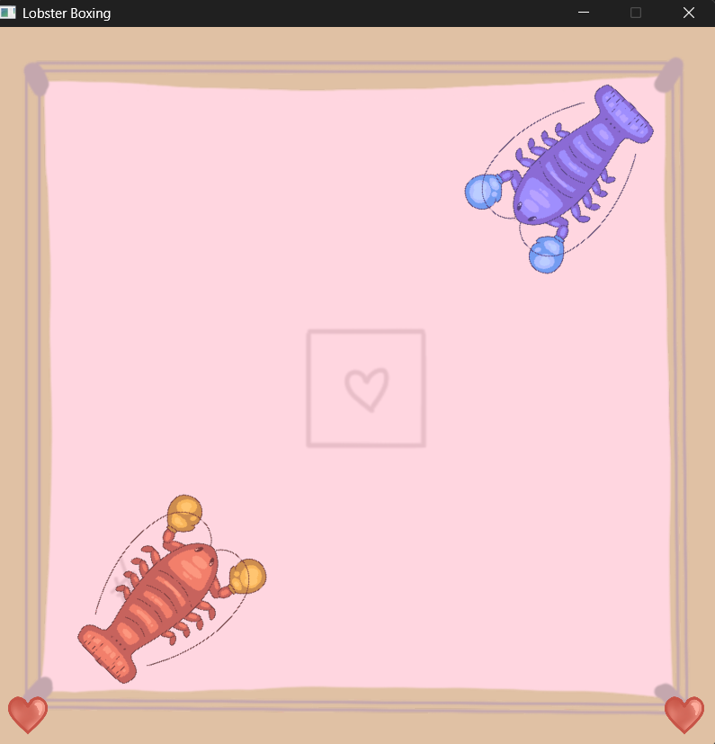
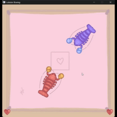

# Lobster Boxing
Lobsters that box! Made in 24-hours for [.devhacks 2026](https://devhacks-2026.devpost.com/) and won the "Chaotic Good" category! Was mostly an excuse to learn/play with Simple Direct Media Layer 3 ([SDL3](https://www.libsdl.org/)) and we're very happy with how it turned out! The code was written by me (newburyf) and the wonderful art was all done by toad-png! Thanks to the UofM .devclub for running the event!

## Controls
The game is two player multiplayer on one keyboard, my laptop doesn't have a numpad so they are a bit akward but thats part of the charm of the game.
#### Player 1
- W: up
- A: left
- S: down
- D: right
- Q: rotate counter clockwise
- E: rotate clockwise
- C: punch

#### Player 2
- O: up
- K: left
- L: down
- ; (semicolon): right
- I: rotate counter clockwise
- P: rotate clockwise
- / (forward slash): punch